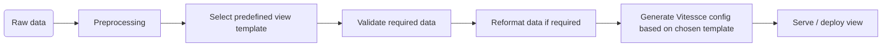
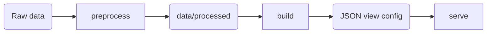

# Vitessce evaluation

The goal of this subfolder is to provide a minimal functional environment to
evaluate whether Vitessce is suitable to replace CellXGene for the CellXPatient
project.

The focus is on tool fit and deployment requirements. It is not intended to
implement the complete production workflow.

## Initial theoretical workflow

Proposed initial theoretical workflow from data preprocessing to view visualization.



## Current prototype

The prototype is a small Python package ([src/vitessce_test](src/vitessce_test)) with
a command-line interface in three steps:
 



Vitessce configurations are generated programmatically using the Python API in
[build.py](src/vitessce_test/build.py). To facilitate the creation of a Vitessce view,
the expected configuration is defined using a more human-readable YAML template
(see [example_template.yaml](example_template.yaml)).

### Template Structure

The template contains three main sections:
- Datasets

  It defines the datasets used in the view and, when required, paths to specific
  elements within them.
  Default paths are used for standard AnnData and SpatialData structures, so the
  template only needs to specify paths that differ from these defaults.
  Defaults can be found in [datasets.py](src/vitessce_test/datasets.py).

- Views

  It defines which Vitessce views should be displayed, which datasets they refer to,
  and their position and size on a 12 × 12 grid.

- Coordination

  It defines how views interact and update together. This is the most tricky part
  of the Vitessce configuration.

  A coordination type represents a property that can be coordinated, such as
  featureSelection, obsSetSelection or obsColorEncoding. Not every view
  supports every coordination type and the coordination types have expected values depending on their definition;
  refer to the [Vitessce coordination documentation](https://vitessce.io/docs/coordination-types/#initial-coordination-values).

  For each coordination type, one or more coordination scopes can exist.
  Views referencing the same scope share the state of the corresponding coordination type:

  - view_1: coord_type_A -> scope_1
  - view_2: coord_type_A -> scope_1
  - view_3: coord_type_A -> scope_2

  Here, view_1 and view_2 are coordinated for coord_type_A, while view_3
  is independent.

  Spatial views require additional hierarchical coordination for individual
  image and segmentation layers. The current prototype uses this to display the
  morphology image together with cell and nucleus boundaries, while linking the
  cell segmentation to selected gene expression.

## Setup
 
Install the package in editable mode (`pip install -e .` or `uv sync`) and build
the frontend once:
 
```bash
cd frontend
npm install
npm run build
```

## Usage
 
Run `vitessce-test <command> --help` for all options.
 
### 1. Preprocess the data
 
Converts an AnnData (h5ad or zarr) or a Xenium dataset into a Vitessce-ready zarr 
store in `data/processed`. The
expression matrix is stored as a CSC sparse matrix and the input is never
modified. Existing outputs are only replaced with the option `--overwrite`.
 
- AnnData (`.h5ad` or `.zarr`), optionally keeping only the cells where an obs
  column equals a value:
 
  ```bash
  vitessce-test preprocess --type anndata --input path/to/dataset.h5ad
  vitessce-test preprocess --type anndata --input path/to/dataset.h5ad --subset condition Healthy --output new_name
  ```
 
- Xenium output directory, with UMAP and clusters from the Xenium analysis files
  (default paths can be changed with `--umap` and `--clusters`):
 
  ```bash
  vitessce-test preprocess --type xenium --input path/to/xenium_output
  ```
 
Without `--output`, the output name is built from the input name
(`<input>_corrected.zarr`, or `<input>_<value>.zarr` for a subset). Use this
path, relative to `data/processed`, as `dataset_path` in the view template.
 
### 2. Build and serve a view
 
```bash
vitessce-test build --template path/to/dataset_template.yaml
```
 
The JSON config is written next to the template as `<name>_view.json`, and the
view is served at <http://127.0.0.1:8008>. Add `--build-only` to only write the
config.
 
### 3. Serve an existing config
 
```bash
vitessce-test serve --config path/to/dataset_view.json
```
 
Both `build` and `serve` accept `--port`. The server hosts the frontend, the
processed data and the config, so no separate data server is needed.

## scRNA data example

> [!IMPORTANT] The current prototype duplicates the input data and several views
> to compare two conditions (Healthy and Disease). The reason is that although
> Vitessce already defines an obsFilter coordination type, no filtering is
> currently applied across the views used here. It is possible to select
> specific metadata conditions, but the observations are still present in all
> plots, just greyed out. Proper obsFilter support would allow conditions to be
> selected dynamically at runtime, avoiding condition-specific data subsets and
> duplicated views. This could potentially be addressed through a fork or a
> custom plugin.

To test the view coordination with Vitessce, we consider a theoretical scRNA view
template that compares gene expression between two conditions (e.g. **Healthy vs
Disease**).

### Data source

The data used for the scRNA view template is the [DUNLAP 2022 dataset](https://biohub.skinsciencefoundation.org/download/Dunlap_2022_all_final_label_transfer_swapped.h5ad) on the [Skin Science Foundation BioHub](https://biohub.skinsciencefoundation.org/filecrawl).


### Prototype view template

The view is generated using the [corresponding YAML template](data/processed/dunlap_2022_healthy_x_sle_template.yaml). The following diagram shows in essence
the plots layout and coordination space, to facilitate the composition of the template.

<table>
  <tr>
    <th> x </th>
    <th>Grid 1-3</th>
    <th>Grid 4-6</th>
    <th>Grid 7-9</th>
    <th>Grid 10-12</th>
  </tr>
  <tr>
    <td>Grid 1-4</td>
    <td colspan="2">Scatterplot UMAP Healthy 
      (Scope A for gene feature, Scope B for cell feature)</td>
    <td colspan="2">Scatterplot UMAP Disease
      (Scope A for gene feature, Scope C for cell feature)</td>
  </tr>
  <tr>
    <td>Grid 5-6</td>
    <td>Cell type Healthy
      (Scope B)</td>
    <td>Cell type Comp. Healthy
      (Scope B)</td>
    <td>Cell type Disease
      (Scope C)</td>
    <td>Cell type Comp. Disease
      (Scope C)</td>
  </tr>
  <tr>
    <td>Grid 7-10</td>
    <td colspan="2">Heatmap Healthy
      (Scope A for gene feature, Scope B for cell feature)</td>
    <td colspan="2">Heatmap Disease
      (Scope A for gene feature, Scope C for cell feature)</td>
  </tr>
  <tr>
    <td>Grid 11-12</td>
    <td colspan="2">Gene-linked Violin Plot Healthy
      (Scope A for gene feature, Scope B for cell feature)</td>
    <td colspan="2">Gene-linked Violin Plot Healthy
      (Scope A for gene feature, Scope C for cell feature)</td>
  </tr>

</table>

## Spatial data example

To test the coordination between multi-layer spatial data and gene expression data, we consider 
a theoretical spatial view template.

### Data source

The data used for the spatial view template is the Xenium 0OE1 example dataset provided by Antonin Thiebault.

### Prototype view template
The view is generated using the [corresponding YAML template](data/processed/xenium_0OE1_example_template.yaml). The following diagram shows in essence
the plots layout and coordination space, to facilitate the composition of the template.

<table> 
  <tr> 
    <th>x</th> 
    <th>Grid 1-2</th> 
    <th>Grid 3-7</th> 
    <th>Grid 8-12</th> 
  </tr>
  <tr> 
    <td>Grid 1</td> 
    <td>Description</td> 
    <td rowspan="3">Spatial view (Scope A for cell/gene; Scope B for nucleus layer; Scope C for image layer)</td> 
    <td rowspan="3">Scatterplot UMAP (Scope A for cell/gene)</td> 
  </tr>
  <tr> 
    <td>Grid 2</td> 
    <td>Status</td> 
  </tr>
  <tr> 
    <td>Grid 3-6</td> 
    <td>Layer controller (Scopes A, B, C)</td> 
  </tr>
  <tr> 
    <td>Grid 7-9</td> 
    <td>Cell Sets (Scope A for cell)</td> 
    <td rowspan="2">Heatmap (Scope A for cell/gene)</td> 
    <td rowspan="2">Gene-linked Violin Plot (Scope A for cell/gene)</td> 
  </tr>
  <tr> 
    <td>Grid 10-12</td> 
    <td>Feature List (Scope A for gene)</td> 
  </tr>
</table>
