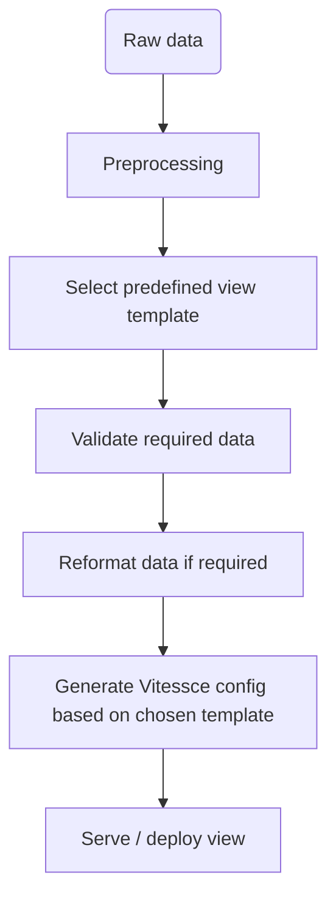

# Vitessce evaluation

The goal of this subfolder is to provide a minimal functional environment to evaluate whether Vitessce is suitable to replace CellXGene for 
the CellXPatient project.

The focus is on tool fit and deployment requirements. It is not intended to implement the complete production workflow.

## Input data

Preprocessed scRNA and spatial data can be found in the `data` folder.

## Initial theoretical workflow

It is likely that several types of views will be required for the CellXPatient project, for ex. Spatial Data only, scRNA + spatial, or Healthy vs Tumoral sample from the same patient, etc... There should be thus a clear data preparation/validation wrt each predefined view. 

## Current prototype
> [!IMPORTANT]
> The current prototype duplicates the input data and several views to compare two conditions (Healthy and Disease). The reason is that although Vitessce already defines an obsFilter coordination type, no filtering is currently applied across the views used here. It is possible to select specific metadata conditions, but the observations are still present in all plots, just greyed out. Proper obsFilter support would allow conditions to be selected dynamically at runtime, avoiding condition-specific data subsets and duplicated views. This could potentially be addressed through a fork or a custom plugin.

To test the suitability of Vitessce, we consider a theoretical scRNA view template that compares gene expression between two conditions (e.g. **Healthy vs Disease**).

The view is generated programmatically using the Vitessce Python API in [`build_view.py`](./build_view.py). The script:

* creates condition-specific AnnData/Zarr subsets from the preprocessed input;
* configures UMAP, cell-set, cell set sizes, heatmap and violin plots;
* defines coordination scopes between related components;
* generates the corresponding Vitessce `config.json`.

### Prototype view template

<table>
  <tr>
    <th> x </th>
    <th>Grid 1</th>
    <th>Grid 2</th>
    <th>Grid 3</th>
    <th>Grid 4</th>
  </tr>
  <tr>
    <td>Grid 1</td>
    <td colspan="2" rowspan="2">Scatterplot UMAP Healthy</td>
    <td colspan="2" rowspan="2">Scatterplot UMAP Disease</td>
  </tr>
  <tr>
    <td>Grid 2</td>
  </tr>
  <tr>
    <td>Grid 3</td>
    <td rowspan="2">Cell type Healthy</td>
    <td rowspan="2">Cell type Comp. Healthy</td>
    <td rowspan="2">Cell type Disease</td>
    <td rowspan="2">Cell type Comp. Disease</td>
  </tr>
  <tr>
    <td>Grid 4</td>
  </tr>
  <tr>
    <td>Grid 5</td>
    <td colspan="2" rowspan="2">Heatmap Healthy</td>
    <td colspan="2" rowspan="2">Heatmap Disease</td>
  </tr>
  <tr>
    <td>Grid 6</td>
  </tr>
  <tr>
    <td>Grid 7</td>
    <td colspan="2" rowspan="2">Gene-linked Violin Plot Healthy</td>
    <td colspan="2" rowspan="2">Gene-linked Violin Plot Healthy</td>
  </tr>

</table>

## Usage

## Data
